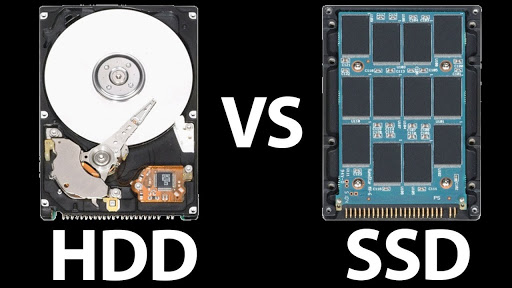

# Intro to Computers

## The Purpose of this Section
The purpose of this section is to introduce you to the following concepts:

- What is hardware?
- What is a computer?
- What are the components of a computer?
- What is a Raspberry Pi?

## What is a Computer?

A computer is an electronic device that manipulates information or data. The computer sees data as 1s and 0s, but it knows how to combine them to create much more complex things like photos, movies, websites, games, and much more.

Computers can be defined as any device that can:

1. Accept an input
2. Perform calculations based on that input
3. Provide an appropriate output

A computer system consists of two major elements, hardware and software. In this lesson, you are going to learn about hardware.

## What is Hardware?

**Hardware** refers to the physical elements that make up a computer. These are the <ins>components that you can physically touch.</ins>

Computers are composed of several hardware components. Some might be more familiar than others. In this lesson, you will learn to recognize some of the different components of a computer and begin to understand what they do.

## Core Components of a Computer

### 1. Processer

#### Key Terms
- Central Processing Unit (CPU)
- Arithmetic Logic Unit (ALU)
- Control Unit (CU)

Processors are the components that process and execute inputs received from hardware and software. This is also known as the Central Processing Unit (CPU). The CPU is thought of as the brain of the computer. It processes information and instructions from software running and other hardware components. CPU’s can be found on the motherboard, and relies on other pieces of hardware such as chipsets to control the dataflow to and from other parts of the computer. Chipsets are groups of microchips located on the motherboard. There are two components that make up the CPU: the control unit and the arithmetic logic unit (ALU). 

The control unit receives instructions from memory and then decodes the instructions into commands.

The ALU is a digital circuit inside the processor that handles arithmetic and logical operations.. After the control unit provides the ALU with the instruction on the operations that must be performed, the ALU is responsible for executing the commands from the control unit. The control unit then moves this data back to memory.  

### RAM
**Key Terms**
- Random Access Memory (RAM): <!-- Insert Definition 
Here -->
- Volatile Memory: <!-- Insert Definition Here -->

### Internal Storage
**Key Terms**
- Hard Drive: <!-- Insert Definition Here -->
- Non-Volatile Memory: <!-- Insert Definition Here -->
- Fard Disk Drive (HDD): <!-- Insert Definition Here -->
- Solid State Drive (SSD): <!-- Insert Definition Here -->

### Motherboard
**Key Terms**

### Input Devices
**Key Terms**

<!-- Insert Image Here -->

### Output Devices
**Key Terms**
<!-- Insert Image Here -->
